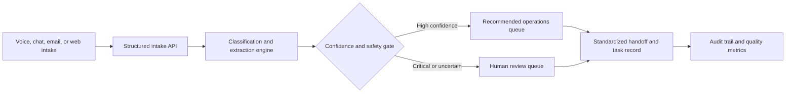

# AI Operations Triage & Quality Platform

An end-to-end, human-in-the-loop portfolio project demonstrating how operational interactions can move from unstructured intake to structured decisions, traceable routing, analyst handoffs, and measurable quality controls.

> This project uses synthetic records only. It does not contain employer data, proprietary workflows, customer information, or production integrations.


## Why This Project Exists

Operations teams often treat the customer interaction and the resulting analyst work as separate events. That creates missing context, repeated questions, inconsistent routing, and weak accountability.

This platform demonstrates a better operating model:

1. Capture an interaction from voice, chat, email, or web.
2. Extract structured identifiers and operational context.
3. Classify category, urgency, confidence, and destination queue.
4. Generate a standardized handoff for the receiving analyst.
5. Escalate critical or low-confidence cases for human review.
6. Preserve an auditable decision trail.
7. Measure automation, confidence, review demand, and estimated time savings.

## Product Preview

The dashboard includes:

- Functional Overview, Review Queue, Routing, and Evaluations workspaces
- Executive-ready operational metrics
- Priority and low-confidence review queues
- Explainable routing decisions
- Structured field extraction
- Standardized analyst handoffs
- Human confirmation and correction
- Full audit history
- Queue-level workload distribution

## Architecture



## Technical Highlights

- **FastAPI:** Typed REST endpoints and automatically generated OpenAPI documentation.
- **Pydantic:** Validated intake, review, case, audit, and metric models.
- **Explainable routing:** Deterministic rules expose why each recommendation was made.
- **Human-in-the-loop controls:** Critical and uncertain cases are flagged instead of silently automated.
- **Synthetic dataset:** Twelve representative interactions spanning safety, claims, billing, access, delivery, and general operations.
- **Evaluation dataset:** 300 balanced, labeled, reproducible interactions across six categories and four channels.
- **Evaluation layer:** Accuracy, macro F1, per-class precision and recall, critical-escalation recall, false-automation rate, confusion matrix, and operational metrics.
- **Responsive dashboard:** Dependency-free HTML, CSS, and JavaScript served directly by FastAPI.
- **Automated tests:** Coverage for routing, safety escalation, low-confidence review, API intake, and analyst review.

## API

| Method | Endpoint | Purpose |
| --- | --- | --- |
| `GET` | `/api/health` | Service health |
| `GET` | `/api/cases` | List decision records |
| `POST` | `/api/cases` | Analyze and route a new interaction |
| `GET` | `/api/cases/{case_id}` | Inspect one interaction |
| `POST` | `/api/cases/{case_id}/review` | Record a human review or correction |
| `GET` | `/api/metrics` | Operational and quality metrics |
| `GET` | `/api/evaluation` | Reproducible 300-case benchmark report |
| `GET` | `/api/routing-rules` | Explainable queue rules and review policies |
| `POST` | `/api/reset` | Restore the synthetic demo dataset |

Interactive API documentation is available at `/docs` when the service is running.

## Evaluation Dataset

`data/synthetic_interactions.csv` contains 300 labeled interactions generated with a fixed seed. The dataset is balanced across six operational categories, evenly distributed across voice, chat, email, and web channels, and includes expected category, queue, priority, and escalation outcomes.

The benchmark intentionally includes alternate phrasing and overlapping signals. Current results are calculated at runtime rather than hard-coded:

- **96.7% category accuracy**
- **96.6% macro F1**
- **100% priority accuracy**
- **100% critical-escalation recall**
- **0% false-automation rate** under the current confidence and safety policy

Regenerate the dataset deterministically with:

```bash
python scripts/generate_dataset.py
```

## Run Locally

```bash
python3 -m venv .venv
source .venv/bin/activate
pip install -e '.[dev]'
uvicorn app.main:app --reload
```

Open `http://127.0.0.1:8000`.

## Test

```bash
pytest
```

## Design Principles

- Automate recommendations, not accountability.
- Route uncertainty to people instead of hiding it.
- Keep customer context attached to operational work.
- Make quality measurable and decisions auditable.
- Demonstrate business impact alongside technical capability.

## Roadmap

- Provider-agnostic LLM structured-output adapter
- Evaluation dataset with expected classifications and confusion matrix
- Persistent PostgreSQL storage
- Role-based review queues
- Webhook and task-management integrations
- Prompt and routing version comparisons
- Containerized cloud deployment

## Author

Built by [Billy Pierre](https://github.com/bilp9), an operations leader and AI automation builder focused on practical systems that improve workflow quality, speed, and accountability.
